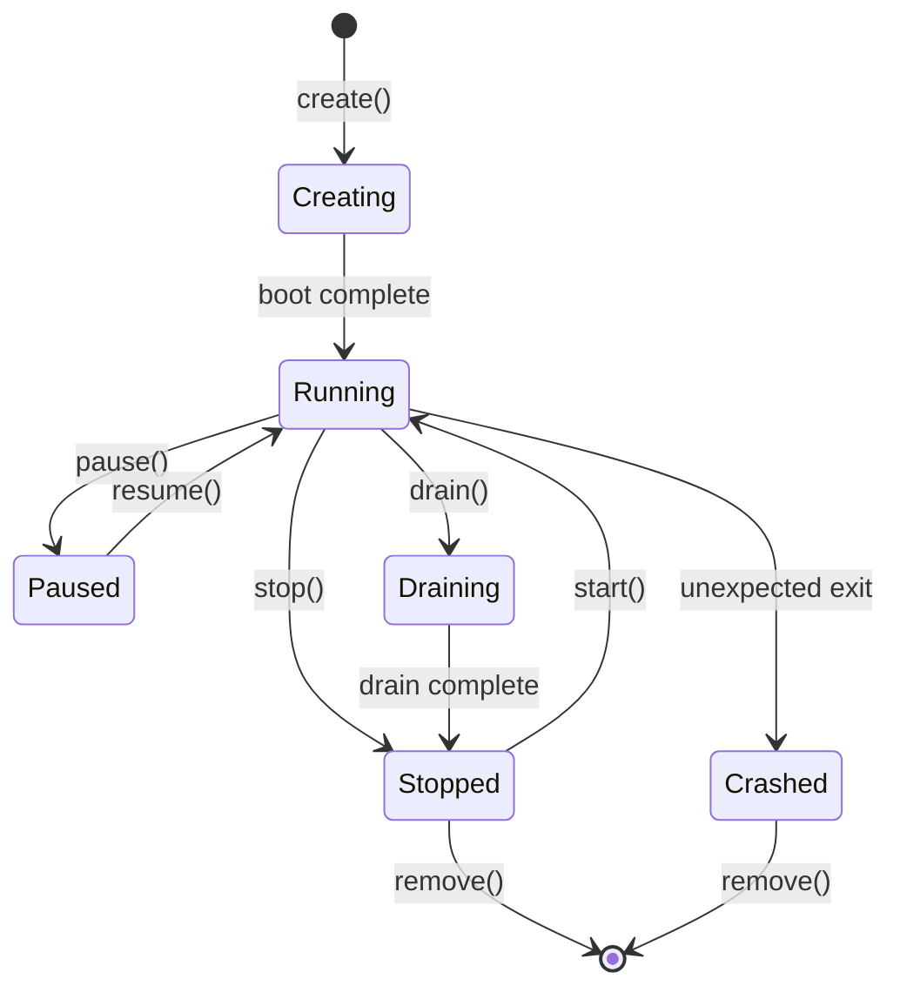
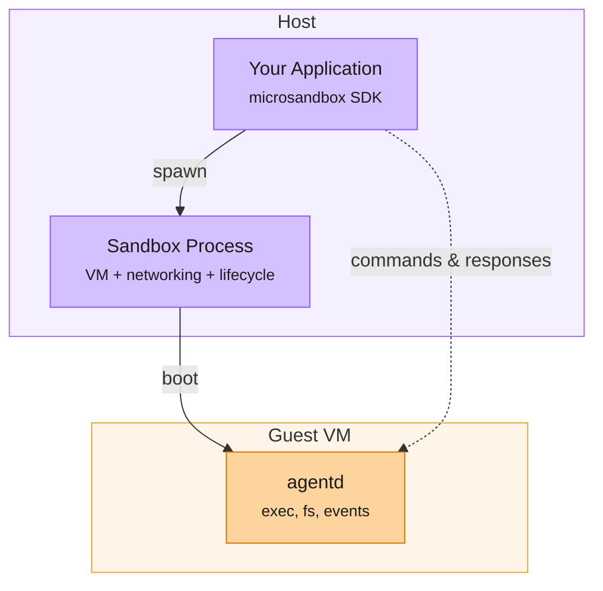

Each sandbox runs as a child process of whatever application creates it. `Sandbox.create` boots a microVM, starts the guest agent inside it, and establishes a communication channel back to the host.

Understanding the lifecycle is useful once you start managing long-running sandboxes, graceful shutdown, or resilient agent workflows.



## States

| Status | Description |
|--------|-------------|
| **Creating** | The VM is booting. The kernel is loaded, the filesystem is mounted, and the guest agent is initializing (configuring network, setting up the environment). |
| **Running** | The guest agent is ready. You can call `exec`, `shell`, `fs`, and `emit`. |
| **Paused** | All guest processes are frozen. No CPU cycles consumed. Resume is instant with no re-boot or re-init. |
| **Draining** | Graceful shutdown in progress. Existing commands run to completion, but new `exec` calls are rejected. Transitions to Stopped when all commands finish. |
| **Stopped** | The VM has shut down. Sandbox configuration and state are persisted to the database and can be restarted. |
| **Crashed** | The VM exited unexpectedly (e.g., kernel panic, OOM kill). |

## Create a sandbox

Creating a sandbox boots the microVM, mounts the filesystem, initializes the guest agent, and waits until it's ready to accept commands.

<CodeGroup>
```rust Rust
// Attached: sandbox stops when your process exits
let sb = Sandbox::builder("worker").image("python:3.12").create().await?;

// Detached: sandbox survives after your process exits
let sb = Sandbox::builder("worker").image("python:3.12").create_detached().await?;
```

```typescript TypeScript
// Standard creation (attached, sandbox stops when your process exits)
const sb = await Sandbox.create({ name: "worker", image: "python:3.12" })

// Detached creation (sandbox survives after your process exits)
const sb = await Sandbox.createDetached({ name: "worker", image: "python:3.12" })
```

</CodeGroup>

## Stop and restart

Stopping gracefully terminates guest processes and shuts down the VM. The sandbox moves to `Stopped` and can be restarted later with all its configuration preserved.

<CodeGroup>
```rust Rust
sb.stop().await?;

let sb = Sandbox::start("worker").await?;
```

```typescript TypeScript
await sb.stop()

// Later, resume where you left off
const sb = await Sandbox.start("worker")
```

</CodeGroup>

## Kill immediately

If a sandbox is unresponsive (e.g., stuck in a tight loop or a panic), force-kill it. The sandbox is terminated immediately with no graceful shutdown.

<CodeGroup>
```rust Rust
sb.kill().await?;
```

```typescript TypeScript
await sb.kill()
```

</CodeGroup>

## Pause and resume <sup><sup>coming soon</sup></sup>

Freeze all guest processes without shutting down. The VM uses zero CPU while paused, and resume is instant. The guest continues exactly where it left off with no boot time and no re-init.

<CodeGroup>
```rust Rust
sb.pause().await?;
sb.resume().await?;
```

```typescript TypeScript
await sb.pause()
await sb.resume()
```

</CodeGroup>

## Detach

Keeps a sandbox running after the parent process exits. It becomes a background process that you can reconnect to later with `Sandbox::get("worker")`.

<CodeGroup>
```rust Rust
sb.detach().await;
```

```typescript TypeScript
await sb.detach()
```

</CodeGroup>

<Tip>
  Detached sandboxes are tracked at `~/.microsandbox/db/`. A background reaper periodically checks for stale sandboxes that have exited unexpectedly and cleans up their records.
</Tip>

## Drain

Trigger a graceful shutdown that lets existing commands finish but rejects new ones. The sandbox moves to `Draining` and transitions to `Stopped` when all in-flight commands complete. This is useful for zero-downtime rotation of worker sandboxes.

<CodeGroup>
```rust Rust
sb.drain().await?;
```

```typescript TypeScript
await sb.drain()
```

</CodeGroup>

## Remove

Delete a stopped sandbox and its associated state from disk.

<CodeGroup>
```rust Rust
Sandbox::remove("worker").await?;
```

```typescript TypeScript
await Sandbox.remove("worker")
```

</CodeGroup>

## List and inspect

<CodeGroup>
```rust Rust
for handle in Sandbox::list().await? {
    println!("{}: {:?}", handle.name(), handle.status());
}
```

```typescript TypeScript
const sandboxes = await Sandbox.list()
for (const info of sandboxes) {
    console.log(`${info.name}: ${info.status}`)
}

const handle = await Sandbox.get("worker")
console.log(handle.status) // "Running" | "Stopped" | ...
```

</CodeGroup>

## Runtime process architecture

Here's what's running and how the pieces talk to each other.



There are two layers here. The **sandbox process** runs the VM and the networking stack on the host side, and relays messages between the application and the **guest agent** inside the VM. Up to 16 clients can connect to the same sandbox simultaneously.

The sandbox process also handles:

- Graceful stop and drain signals
- Cleanup when the sandbox exits
- Idle detection (auto-drain after a configurable timeout)
- Maximum sandbox lifetime enforcement

The sandbox process does not execute guest commands itself. It only relays traffic between your application and the guest agent.

## Sandbox Process Policies

For production workloads, configure how the sandbox process handles shutdown, idle detection, and maximum lifetime.

<CodeGroup>
```rust Rust
let sb = Sandbox::builder("worker")
    .image("python:3.12")
    .max_duration(3600)
    .idle_timeout(300)
    .create()
    .await?;
```

```typescript TypeScript
const sb = await Sandbox.create({
    name: "worker",
    image: "python:3.12",
    maxDurationSecs: 3600,  // maximum sandbox lifetime in seconds
})
```

</CodeGroup>
